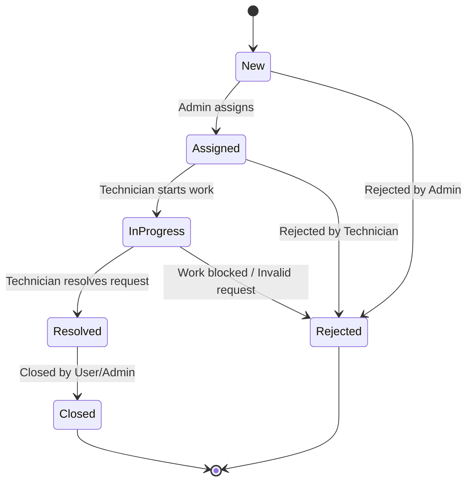
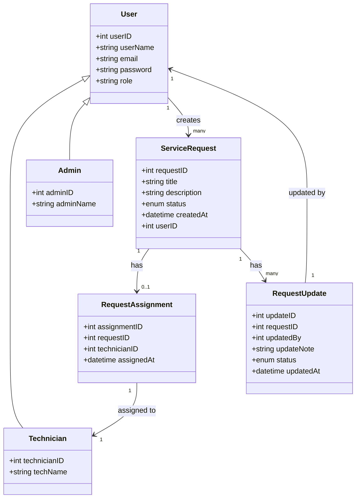
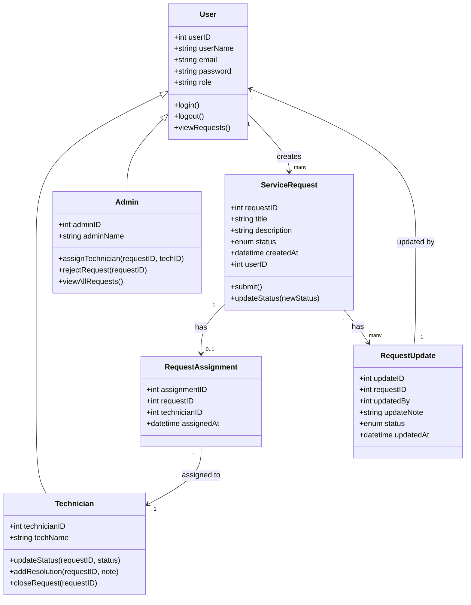

# Service-Request-Handling-Project

manikanta_work123

## Activity Diagram 


## State Diagram



## UML Use Case Diagram

```mermaid
%% Mermaid UML Use Case Diagram
%% Paste into GitHub README.md

%%{init: {'theme': 'default'}}%%
graph TD
    actorUser(User)
    actorAdmin(Admin)
    actorTech(Technician)

    UC1[Submit Service Request]
    UC2[View Request Status]
    UC3[Login]
    UC4[Logout]

    UC5[View All Requests]
    UC6[Assign Technician]
    UC7[Reject Request]

    UC8[Update Request Status]
    UC9[Add Resolution Note]
    UC10[Close Request]

    %% User actions
    actorUser --> UC1
    actorUser --> UC2
    actorUser --> UC3
    actorUser --> UC4

    %% Admin actions
    actorAdmin --> UC3
    actorAdmin --> UC4
    actorAdmin --> UC5
    actorAdmin --> UC6
    actorAdmin --> UC7

    %% Technician actions
    actorTech --> UC3
    actorTech --> UC4
    actorTech --> UC8
    actorTech --> UC9
    actorTech --> UC10
```




## UML Class Diagram




## 🧱 UML Class Diagram with Methods – Service Request System




## 🗄️ SQL Schema – Service Request Handling System

```sql
-- Users Table
CREATE TABLE Users (
    UserID INT PRIMARY KEY AUTO_INCREMENT,
    UserName VARCHAR(100),
    Role ENUM('User', 'Admin', 'Technician'),
    Email VARCHAR(100),
    Password VARCHAR(100)
);

-- Service Requests Table
CREATE TABLE ServiceRequests (
    RequestID INT PRIMARY KEY AUTO_INCREMENT,
    UserID INT,
    Title VARCHAR(100),
    Description TEXT,
    Status ENUM('New', 'Assigned', 'In Progress', 'Resolved', 'Closed', 'Rejected'),
    CreatedAt DATETIME DEFAULT CURRENT_TIMESTAMP,
    FOREIGN KEY (UserID) REFERENCES Users(UserID)
);

-- Request Assignments Table
CREATE TABLE RequestAssignments (
    AssignmentID INT PRIMARY KEY AUTO_INCREMENT,
    RequestID INT,
    TechnicianID INT,
    AssignedAt DATETIME DEFAULT CURRENT_TIMESTAMP,
    FOREIGN KEY (RequestID) REFERENCES ServiceRequests(RequestID),
    FOREIGN KEY (TechnicianID) REFERENCES Users(UserID)
);

-- Request Updates Table
CREATE TABLE RequestUpdates (
    UpdateID INT PRIMARY KEY AUTO_INCREMENT,
    RequestID INT,
    UpdatedBy INT,
    UpdateNote TEXT,
    Status ENUM('Assigned', 'In Progress', 'Resolved', 'Closed'),
    UpdatedAt DATETIME DEFAULT CURRENT_TIMESTAMP,
    FOREIGN KEY (RequestID) REFERENCES ServiceRequests(RequestID),
    FOREIGN KEY (UpdatedBy) REFERENCES Users(UserID)
);

