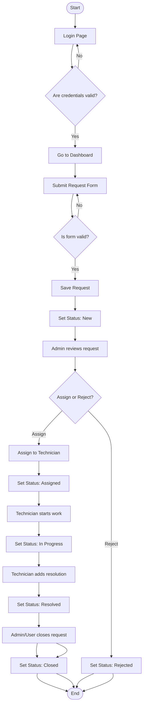
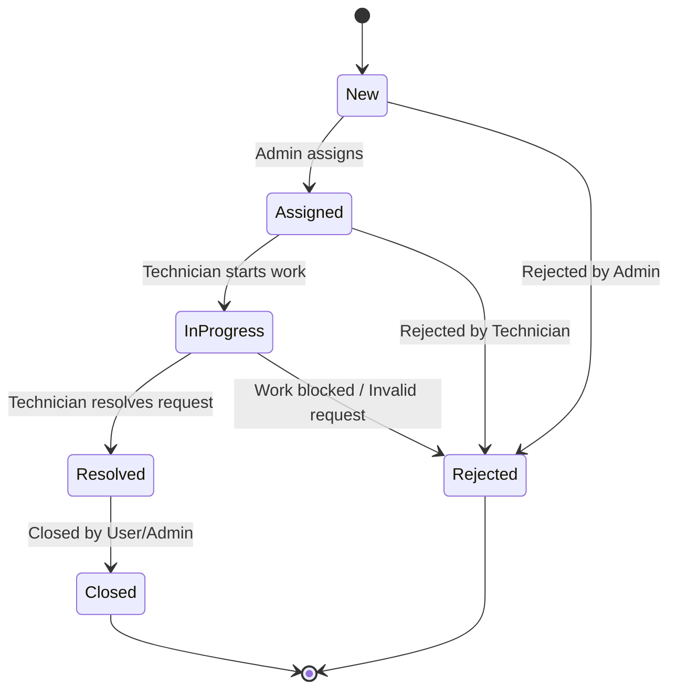
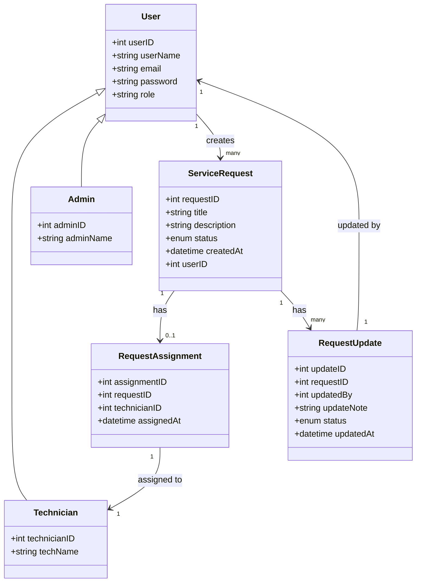
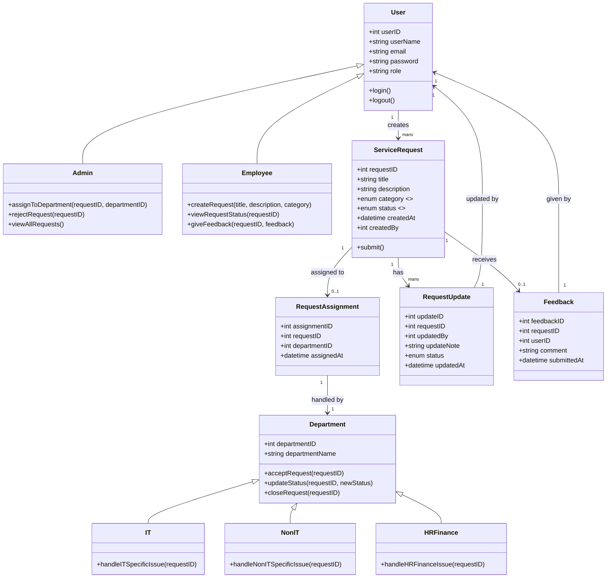

# Service-Request-Handling-Project

## 🔐 Admin Login

**URL:** `POST /admin/login`

**Request JSON:**

```json
{
  "email": "admin@example.com",
  "password": "adminpass"
}
```

**Response Example:**

```json
{
  "status": "success",
  "message": "Login successful"
}
```

---

## 📄 Get Tickets Raised by Specific Employee

**URL:** `GET /admin/employee/tickets/{id}`  
Replace `{id}` with the employee ID.

**Example:** `GET /admin/employee/tickets/101`

**Response Example:**

```json
{
  "status": "success",
  "data": {
    "employeeId": 101,
    "name": "John Doe",
    "email": "john@example.com",
    "tickets": [
      {
        "ticketId": 1,
        "title": "Login Issue",
        "description": "Cannot login to portal",
        "status": "RAISED"
      }
    ]
  }
}
```

---

## 📋 Get All Employee Tickets

**URL:** `GET /admin/employees/tickets`

**Response Example:**

```json
{
  "status": "success",
  "data": [
    {
      "employeeId": 101,
      "name": "John Doe",
      "email": "john@example.com",
      "tickets": [
        {
          "ticketId": 1,
          "title": "Login Issue",
          "status": "RAISED"
        }
      ]
    },
    {
      "employeeId": 102,
      "name": "Jane Smith",
      "email": "jane@example.com",
      "tickets": []
    }
  ]
}
```

---

## ❌ Cancel a Ticket

**URL:** `POST /admin/ticket/cancel`

**Request JSON:**

```json
{
  "ticketId": 5,
  "cancelReason": "User requested cancellation"
}
```

**Response Example:**

```json
{
  "status": "success",
  "message": "Ticket with ID 5 has been cancelled."
}
```

---

## 🏷️ Assign Ticket to Department

**URL:** `POST /admin/assign-ticket`

**Request JSON:**

```json
{
  "ticketId": 3,
  "departmentId": 2
}
```

**Response Example:**

```json
{
  "status": "success",
  "message": "Ticket assigned to department successfully."
}
```

---


## Activity Diagram 



## State Diagram



## UML Use Case Diagram

```mermaid
%% Mermaid UML Use Case Diagram
%% Paste into GitHub README.md

%%{init: {'theme': 'default'}}%%
graph TD
    actorUser(User)
    actorAdmin(Admin)
    actorTech(Technician)

    UC1[Submit Service Request]
    UC2[View Request Status]
    UC3[Login]
    UC4[Logout]

    UC5[View All Requests]
    UC6[Assign Technician]
    UC7[Reject Request]

    UC8[Update Request Status]
    UC9[Add Resolution Note]
    UC10[Close Request]

    %% User actions
    actorUser --> UC1
    actorUser --> UC2
    actorUser --> UC3
    actorUser --> UC4

    %% Admin actions
    actorAdmin --> UC3
    actorAdmin --> UC4
    actorAdmin --> UC5
    actorAdmin --> UC6
    actorAdmin --> UC7

    %% Technician actions
    actorTech --> UC3
    actorTech --> UC4
    actorTech --> UC8
    actorTech --> UC9
    actorTech --> UC10
```




## UML Class Diagram



#######

