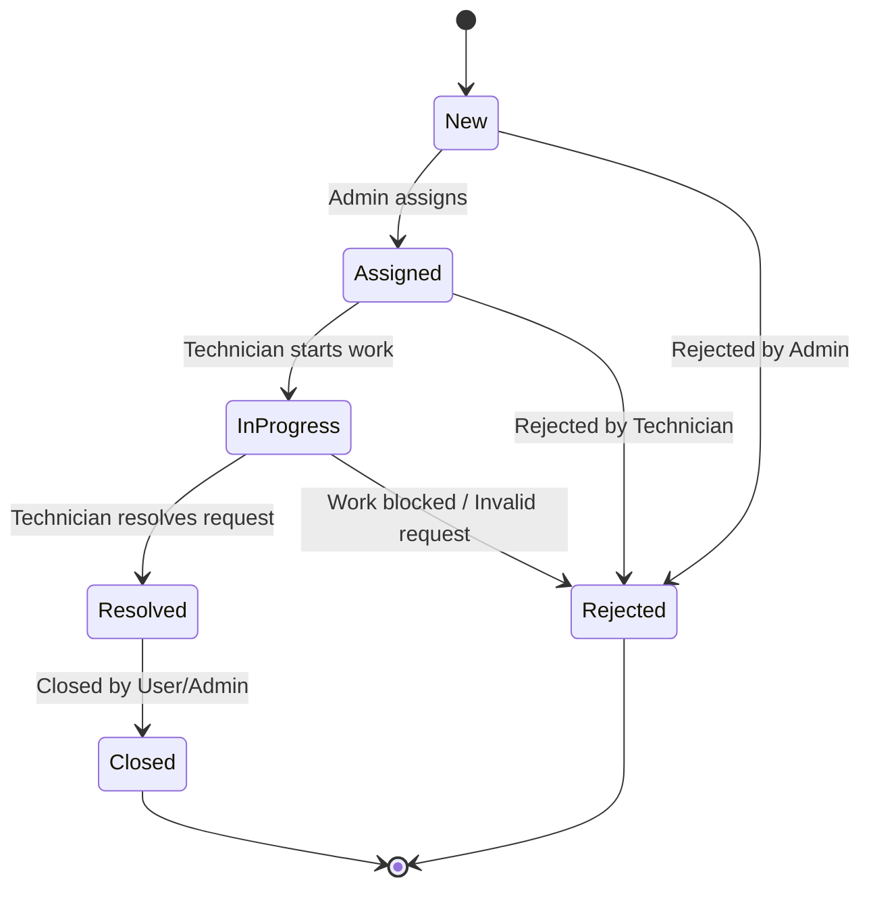
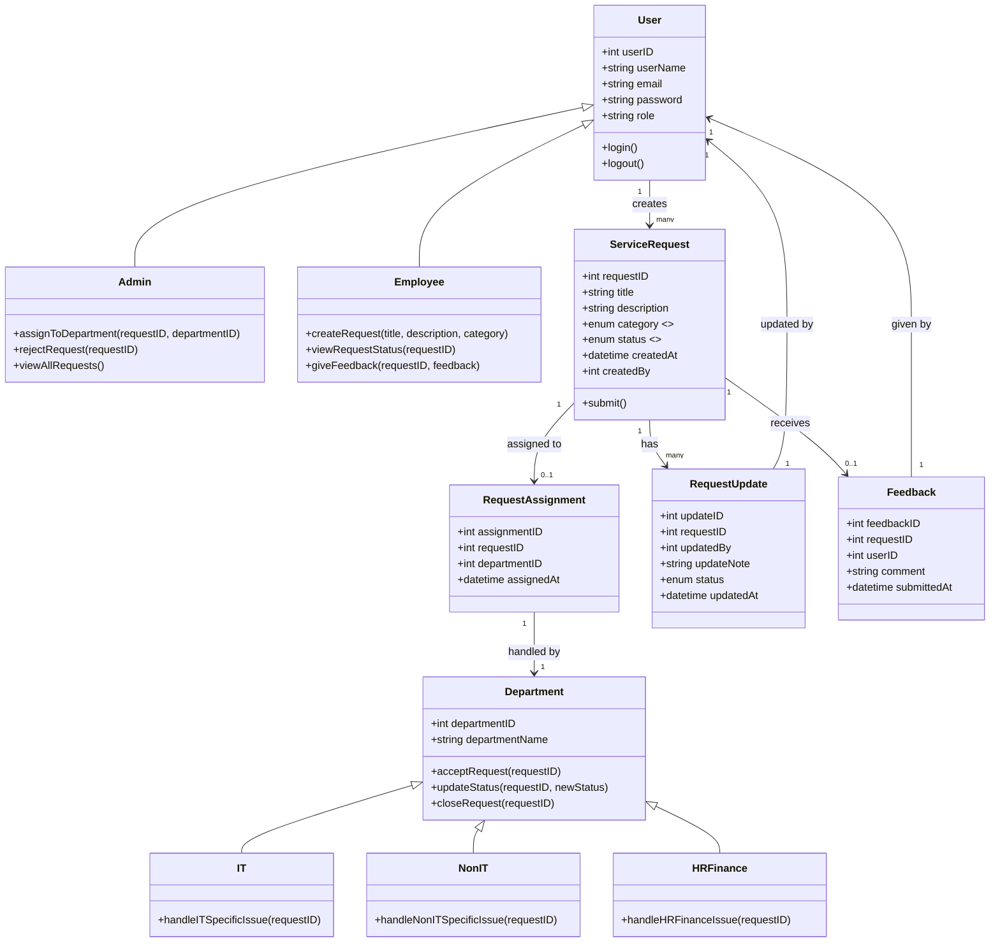

# 🛠️ Service Request Handling System

### Developed by:

**Admin Module**: _K Manikanta Reddy_

**Employee Module**: _M Lahari_

**Department Module**: _D Bhagath Krishna Vamsi_


# 📖 Project Overview
The Service Request Handling System is a centralized platform that enables employees to raise service tickets, admins to assign and manage them, and departments to act on those tickets. The system supports:

Ticket creation, tracking, and cancellation by employees

Ticket assignment and oversight by admins

Ticket resolution, commenting, and closing by departments

This microservice-style project promotes modular responsibility with secure login for different user roles.

# ⚙️ Modules & Responsibilities
## 🧑‍💼 Employee Module (Lahari)
Login

Raise a service request

View my tickets

Cancel my ticket

Provide feedback on resolved ticket

## 🧑‍💻 Department Module (Bhagath)
View assigned tickets

Accept ticket

Update ticket status

Comment on tickets

Close tickets with reason

## 👨‍💼 Admin Module (Manikanta)
Admin login

View all employee tickets

View tickets by employee

Assign ticket to department

Cancel any ticket on behalf of user

# 🔐 Authentication Endpoints
## 🧑 Employee Login
**POST**  ``` /employee/login```

json
```
{
  "email": "employee@example.com",
  "password": "emppass123"
}
```
## 👨 Admin Login
**POST** ```/admin/login```

json
```
{
  "email": "admin@example.com",
  "password": "adminpass"
}
```
# 🎫 Employee Services
## Raise a New Ticket
**POST** ```/raiseTicket```

json
```
{
  "employeeId": 101,
  "title": "System crash",
  "description": "My desktop crashes frequently"
}
```

## View My Tickets
GET ```/viewMyTickets/{id}```


## Cancel My Ticket
**POST** ```/cancleMyTicket/{id}```


## Submit Feedback
**POST** ``` /giveFeedback```

json
```
{
  "ticketId": 4,
  "feedbackText": "Issue resolved quickly, thanks!"
}
```
# 🛠️ Department Services
## View Tickets by Department
GET ```/department/tickets/{departmentId}```

## Accept a Ticket
PUT ```/department/ticket/accept/{ticketId}```

## Update Ticket Status
PUT ```/department/ticket/status```

Request JSON:

json
```
{
  "ticketId": 101,
  "status": "IN_PROGRESS"
}
```
## Add Comment to Ticket
**POST** ```/department/ticket/comment```

json
```
{
  "ticketId": 102,
  "commenterName": "IT Department",
  "commentText": "Issue diagnosed, working on a solution."
}
```
## Close Ticket
PUT ```/department/ticket/close```

json
```
{
  "ticketId": 103,
  "reason": "Issue fixed and confirmed by user."
}
```
# 🛡️ Admin Services
## View Tickets by Employee
GET ```/admin/employee/tickets/{id}```

## View All Employee Tickets
GET ```/admin/employees/tickets```

## Assign Ticket to Department
**POST** ```/admin/assign-ticket```

json
```
{
  "ticketId": 3,
  "departmentId": 2
}
```
## Cancel a Ticket
**POST** ```/admin/ticket/cancel```

json
```
{
  "ticketId": 5,
  "cancelReason": "User requested cancellation"
}
```

## Activity Diagram 


## State Diagram



## UML Use Case Diagram

```mermaid
%% Mermaid UML Use Case Diagram
%% Paste into GitHub README.md

%%{init: {'theme': 'default'}}%%
graph TD
    actorUser(User)
    actorAdmin(Admin)
    actorTech(Technician)

    UC1[Submit Service Request]
    UC2[View Request Status]
    UC3[Login]
    UC4[Logout]

    UC5[View All Requests]
    UC6[Assign Technician]
    UC7[Reject Request]

    UC8[Update Request Status]
    UC9[Add Resolution Note]
    UC10[Close Request]

    %% User actions
    actorUser --> UC1
    actorUser --> UC2
    actorUser --> UC3
    actorUser --> UC4

    %% Admin actions
    actorAdmin --> UC3
    actorAdmin --> UC4
    actorAdmin --> UC5
    actorAdmin --> UC6
    actorAdmin --> UC7

    %% Technician actions
    actorTech --> UC3
    actorTech --> UC4
    actorTech --> UC8
    actorTech --> UC9
    actorTech --> UC10
```




## UML Class Diagram




